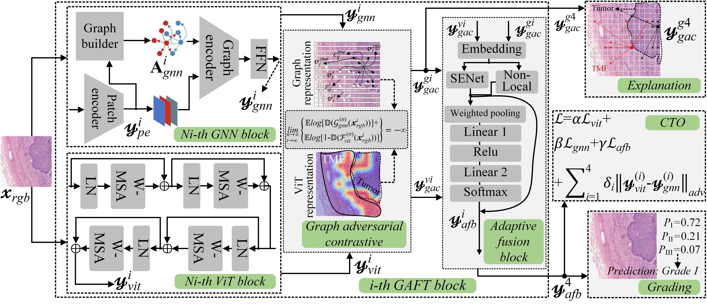

# Graph Adversarial Fusion Transformer for Topology-aware Tumor-Microenvironment Interaction Modeling in LSCC
## 🧔 Authors [* is corresponding authors]
- xxxx

## :fire: News
- [xxxx/xx/xxx] xxxx.

## :rocket: Pipeline
1. Here's an overview of our **GAFT** method:

<div align=center>

</div>


## :mag: TODO
<font color="red">**We are currently organizing all the code. Stay tuned!**</font>
- [x] training code
- [x] Evaluation code
- [x] Model code
- [ ] Pretrained weights
- [ ] Datasets


## 🛠️ Getting Started

To get started with **GAFT**, follow the installation instructions below.

1.  Clone the repo

```sh
git clone https://github.com/Baron-Huang/GAFT
```

2. Install dependencies
   
```sh
pip install -r requirements.txt
```

## :postbox: Contact
If you have any questions, please contact [Dr. Pan Huang](https://scholar.google.com/citations?user=V_7bX4QAAAAJ&hl=zh-CN) (`panhuang@polyu.edu.hk`).
